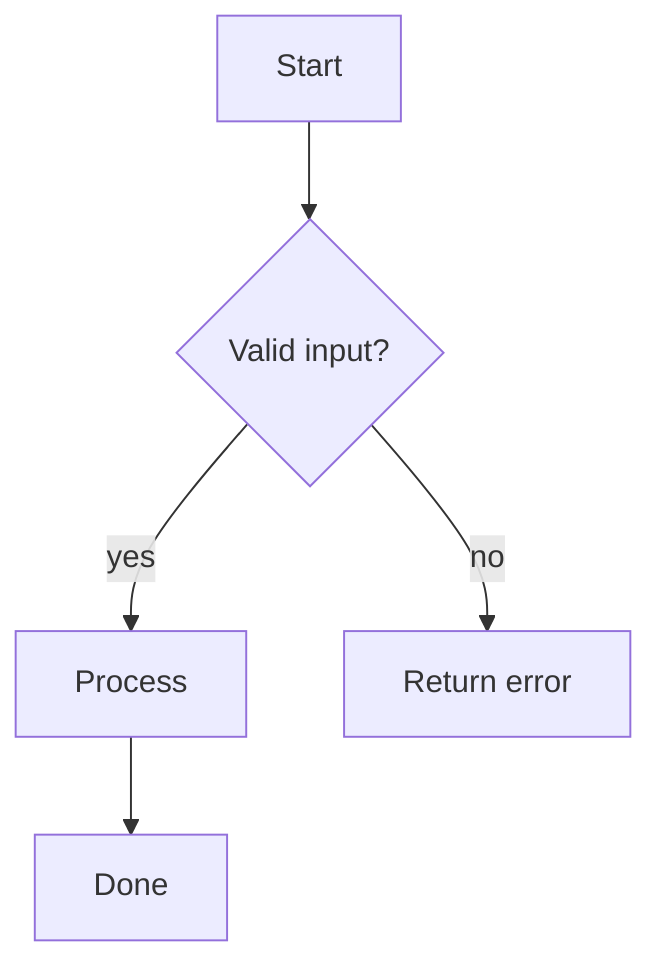
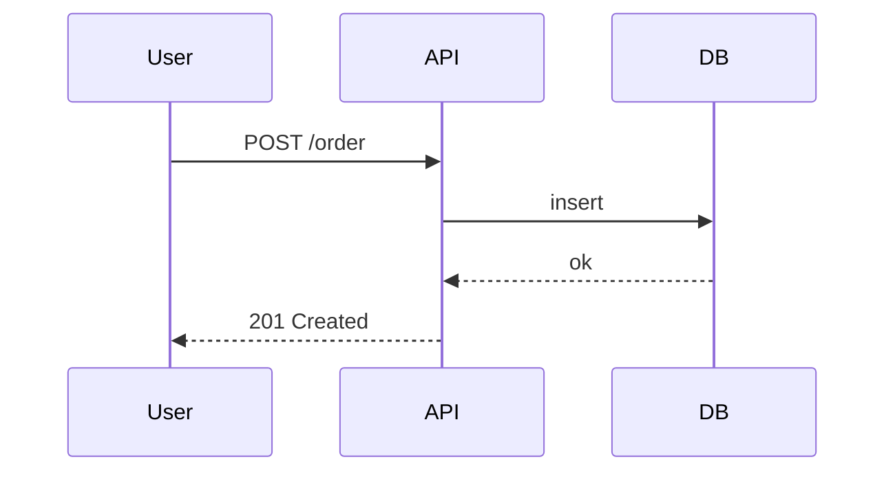
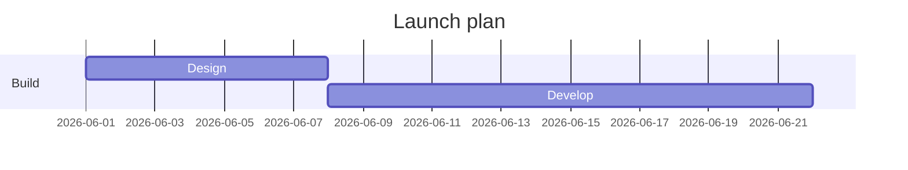

# Mermaid Diagrams

Produce a Mermaid code block the user can paste into GitHub, GitLab, Notion, Obsidian, or
any Markdown that renders Mermaid. Pick the diagram type that fits the question.

## Flowchart (process / decision)

````

````

## Sequence (who calls whom, over time)

````

````

## Gantt (timeline / plan)

````

````

## Also available

- `erDiagram` (data models), `classDiagram` (OOP structure), `stateDiagram-v2` (state machines),
  `mindmap` (idea trees), `pie` (proportions).

## Guidance

- Choose the type by intent: steps→flowchart, interactions→sequence, schedule→gantt, data→ER.
- Keep node labels short; quote labels containing spaces/punctuation: `A["Label: text"]`.
- Always return it inside a ` ```mermaid ` fenced block so it renders.
- Validate mentally that arrows/IDs are balanced; offer a PNG via a render tool only if asked.
